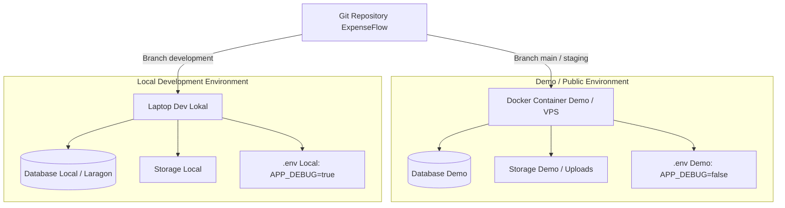

# 🌐 Panduan Lengkap: Persiapan & Peluncuran Demo Publik (Go-Public)

Dokumen ini berisi panduan teknis, strategi arsitektur, dan checklist keamanan untuk merilis versi demo aplikasi **ExpenseFlow** ke publik (klien/tester) tanpa merusak atau mencampuradukkan lingkungan pengembangan (*local development*).

---

## ❓ Apakah Perlu Membuat "Cloning" (Duplikat) Program?

> [!IMPORTANT]
> **Jawabannya: TIDAK PERLU membuat duplikat / copy-paste folder secara manual di laptop.**

### Mengapa Copy-Paste Folder Manual Berbahaya?
1. **Risiko Out-of-Sync**: Jika ada bugfix di folder demo, Anda harus memindahkan perbaikan secara manual ke folder dev utama (rentan tertinggal/konflik).
2. **Membuang Ruang Disk**: `node_modules`, `vendor`, `.dart_tool`, dan assets akan menduplikasi bergiga-giga byte di harddisk.
3. **Membingungkan Git**: Riwayat commit, staging, dan kolaborasi menjadi terpecah.

---

## 🛡️ Pendekatan Standar Industri (Best Practice)

Pemisahan antara lingkungan **Development (Lokal)** dan **Demo (Publik)** dilakukan pada **3 lapisan**:



### 1. Lapisan Kode: Gunakan Git Branch
- **`development` / `main`**: Branch untuk koding aktif sehari-hari.
- **`staging` atau `demo`**: Branch stabil yang siap dicoba publik.
- Saat ada fitur baru yang sudah dites di lokal dan siap ditunjukkan ke klien: cukup `git merge development` ke branch `demo`.

### 2. Lapisan Konfigurasi: File `.env` Terpisah
- **Lokal**: `APP_ENV=local`, `APP_DEBUG=true`, database lokal.
- **Demo Publik**: `APP_ENV=production` atau `staging`, `APP_DEBUG=false` (agar tidak membocorkan stack trace error atau password jika terjadi bug).

### 3. Lapisan Data: Database & Storage Terpisah
- Demo publik harus memiliki database MySQL sendiri yang diisi dengan **dummy data realistis** via Seeder (`php artisan db:seed`).
- File upload struk dan invoice demo disimpan di volume container terpisah agar tidak mengotori file lokal.

---

## 🔒 Checklist Keamanan Sebelum Demo Dibuka ke Publik

Sebelum link demo dibagikan kepada publik/klien:

- [ ] **Matikan Debug Mode**: `APP_DEBUG=false` di `.env` demo.
- [ ] **Generate APP_KEY Baru**: Jangan gunakan `APP_KEY` yang sama dengan lokal (`php artisan key:generate`).
- [ ] **Sanitasi Data Sensitif**: Pastikan tidak ada data asli perusahaan/karyawan nyata. Gunakan data dummy dari `DatabaseSeeder.php`.
- [ ] **Proteksi Login Demo**:
  - Siapkan akun demo siap pakai di halaman landing/login (misal tombol *Quick Fill* atau teks panduan):
    - **Finance**: `finance@expenseflow.demo` / `password123`
    - **HRD**: `hrd@expenseflow.demo` / `password123`
    - **Employee**: `employee@expenseflow.demo` / `password123`
    - **Admin**: `admin@expenseflow.demo` / `password123`
- [ ] **Wajib HTTPS / SSL**: Browser memblokir GPS (Presensi) & Kamera (Scan Struk) jika tidak menggunakan HTTPS.
- [ ] **CORS & Sanctum Domain**: Pastikan `SANCTUM_STATEFUL_DOMAINS` dan `CORS_ALLOWED_ORIGINS` sudah mendaftarkan domain demo publik Anda.

---

## 🚀 2 Pilihan Jalur Menjalankan Demo Publik

---

### Jalur A: Docker di Laptop + Cloudflare Tunnel (Gratis, Tanpa Sewa Server)

Cocok untuk demo singkat, presentasi meeting, atau testing bersama klien dalam waktu terbatas.

#### Kelebihan:
- 100% Gratis.
- Otomatis dapat Domain & SSL/HTTPS resmi dari Cloudflare (GPS & Kamera berfungsi normal).
- Tidak perlu sewa VPS, tidak perlu setting port forwarding di router Wi-Fi.

#### Arsitektur:
```
Laptop (Docker Backend :8000 + Web :3000)
   └── Cloudflare Tunnel Daemon (cloudflared)
         └── Internet (https://demo-api.domainanda.com & https://demo.domainanda.com)
```

#### Langkah Cepat:
1. Pastikan Docker Desktop berjalan di Windows.
2. Jalankan container ExpenseFlow via Docker Compose.
3. Install Cloudflare Tunnel (`cloudflared`):
   ```bash
   cloudflared tunnel --url http://localhost:8000
   ```
4. Cloudflare akan memberikan URL publik HTTPS instan (contoh: `https://random-subdomain.trycloudflare.com`) yang bisa langsung dibuka oleh siapa saja di internet.

---

### Jalur B: Cloud VPS Murah (Rekomendasi untuk Uji Publik 24/7)

Cocok jika Anda ingin link demo bisa diakses kapan saja oleh tester/klien tanpa perlu menyalakan laptop terus-menerus.

#### Rekomendasi Provider Murah:
- **Lokal Indonesia**: IDCloudHost / Biznet GIO / Nevacloud (Rp 50.000 – Rp 90.000 / bulan).
- **Global**: DigitalOcean / Hetzner / Linode ($4 – $5 / bulan).

#### Spesifikasi Minimum Server Demo:
- **OS**: Ubuntu 22.04 LTS atau 24.04 LTS
- **CPU**: 1 - 2 vCPU
- **RAM**: 2 GB (Minimal untuk menjalankan Nginx + PHP-FPM + MySQL + Queue Worker)
- **Disk**: 20 - 40 GB SSD

#### Alur Deploy ke VPS:
```bash
# 1. SSH ke VPS
ssh root@ip-vps-anda

# 2. Install Docker & Docker Compose
curl -fsSL https://get.docker.com -o get-docker.sh
sh get-docker.sh

# 3. Clone Repository dari GitHub
git clone https://github.com/username/expenseflow.git /var/www/expenseflow
cd /var/www/expenseflow

# 4. Setup .env untuk Demo
cp expenseflow-backend/.env.example expenseflow-backend/.env
# Edit .env dengan nano/vim sesuaikan kredensial & APP_ENV=production

# 5. Jalankan Docker
docker compose up -d --build

# 6. Migrate & Seed Database Demo
docker compose exec app php artisan key:generate
docker compose exec app php artisan migrate --seed
docker compose exec app php artisan storage:link
```

---

## 📱 Penyesuaian Aplikasi Web & Mobile untuk Demo

### 1. Frontend Web (`expenseflow-web`)
Di file `.env` frontend web:
```env
VITE_API_BASE_URL=https://api-demo.domainanda.com/api/v1
```
Build bundle statis untuk web:
```bash
npm run build
```
File `dist/` siap di-hosting via Nginx container atau Cloudflare Pages / Vercel (Gratis).

### 2. Mobile App Flutter (`expenseflow-mobile`)
Di file konfigurasi API Flutter (misal `api_client.dart` / environment config):
```dart
const String kBaseUrl = 'https://api-demo.domainanda.com/api/v1';
```
Build APK Demo untuk dibagikan ke tester Android:
```bash
flutter build apk --release
```
File APK di `build/app/outputs/flutter-apk/app-release.apk` siap dikirim ke penguji/klien.

---

## 🔄 Siklus Update Kode Saat Demo Berjalan

Jika ada perbaikan kode selama masa demo publik:

```
[Laptop Dev] Koding perbaikan -> git commit -> git push origin staging
      ↓
[Server Demo / VPS] git pull origin staging -> docker compose exec app php artisan queue:restart
```

Tidak ada file yang bentrok, data demo tetap aman di dalam volume database server.
